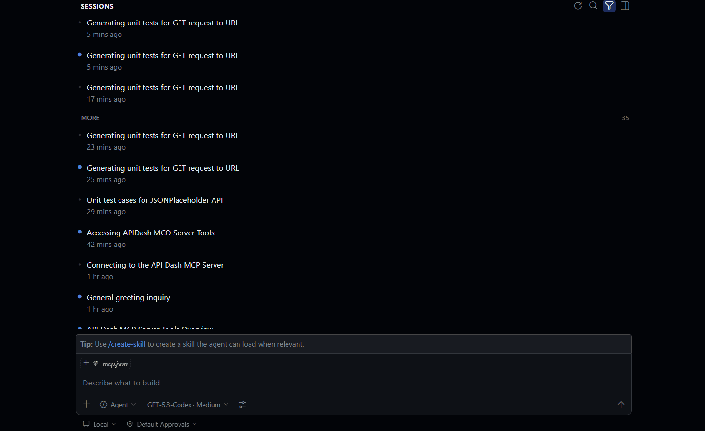

<div align="center">

# apidash-mcp-server

**AI-powered API testing, right inside your editor**

[](https://dart.dev)
[](https://modelcontextprotocol.io)
[](https://ai.google.dev)
[](./LICENSE)

</div>

---

Ever wished you could just *tell* your AI assistant to test an API and actually watch it happen? That's exactly what this does.

This is a standalone [Model Context Protocol](https://modelcontextprotocol.io) (MCP) server written in **Dart**. Point it at any HTTP endpoint, and it uses **Google Gemini** to generate smart test cases — then executes them live against the real API and shows you an interactive results dashboard, all without leaving VS Code.

```
You → "Generate tests for GET https://api.example.com/users/1"

Copilot → generates test cases using Gemini
        → renders an interactive checklist in chat ✅

You → "Run the selected ones"

Copilot → hits the real API, evaluates assertions
        → shows a live pass/fail dashboard inline 📊
```

---

## Demo

> 🎬 *Recording in progress — GIF coming soon*

<!-- Replace the line below with your actual GIF once recorded -->


*The checklist UI and results dashboard render directly inside VS Code chat via MCP Apps.*

---

## How it works

```
┌─────────────────────────────────────┐
│     VS Code + GitHub Copilot        │
│                                     │
│  tools/call generate_unit_tests()   │
│  tools/call run_selected_tests()    │
└───────────────┬─────────────────────┘
                │  JSON-RPC 2.0 / HTTP
                ▼
┌─────────────────────────────────────┐
│    apidash-mcp-server (port 3000)   │
│                                     │
│  bin/server.dart   ← HTTP router    │
│  mcp_tools.dart    ← Gemini + HTTP  │
│  mcp_resources.dart ← HTML UIs      │
└───────────┬─────────────────────────┘
            │                   │
            ▼                   ▼
    Google Gemini API     Your API under test
    (test generation)     (live execution)
```

---

## Project Structure

```
apidash-mcp-server/
├── bin/
│   └── server.dart           ← Entry point, JSON-RPC dispatcher
├── lib/src/
│   ├── mcp_tools.dart        ← Tool logic, Gemini client, assertion engine
│   └── mcp_resources.dart    ← Interactive HTML UIs (MCP Apps)
└── pubspec.yaml
```

---

## Setup

**Prerequisites:** Dart ≥ 3.11 · A [Gemini API key](https://aistudio.google.com/app/apikey) (free tier works fine)

```bash
git clone https://github.com/your-username/apidash-mcp-server
cd apidash-mcp-server
dart pub get
```

Set your API key:

```bash
# macOS / Linux
export GEMINI_API_KEY="your-key-here"

# Windows (PowerShell)
$env:GEMINI_API_KEY = "your-key-here"
```

Start the server:

```bash
dart run bin/server.dart
# ✓ MCP server running at http://localhost:3000
```

---

## Connect to VS Code

Add this to `.vscode/mcp.json` in your workspace (start the server manually first):

```json
{
  "servers": {
    "apidash": {
      "type": "http",
      "url": "http://localhost:3000/mcp"
    }
  }
}
```

Then open the **GitHub Copilot chat** panel → switch to **Agent mode** → you should see the `apidash` tools available.

---

## Tools

### `generate_unit_tests`

Generates AI-powered test cases for any HTTP endpoint and opens an interactive checklist inside chat.

| Parameter | Type | Required | Description |
|-----------|------|----------|-------------|
| `url` | string | ✅ | Full endpoint URL |
| `method` | string | ✅ | GET / POST / PUT / DELETE / PATCH |
| `headers` | object | — | Request headers |
| `body` | string | — | Request body as JSON string |
| `count` | integer | — | Test cases to generate, 1–10 (default: 5) |

---

### `run_selected_tests`

Executes the tests you selected in the checklist and renders a live results dashboard.

| Parameter | Type | Required | Description |
|-----------|------|----------|-------------|
| `test_cases` | array | — | Omit to use last checklist context automatically |

**Supported assertions**

| Type | What it checks |
|------|----------------|
| `status_code` | HTTP response status |
| `response_time_ms` | Max acceptable latency |
| `body_contains` | Substring present in response body |
| `body_not_contains` | Substring absent from response body |
| `body_schema` | JSON object contains required keys |
| `body_value` | JSON field equals expected value |
| `body_type` | JSON field is of expected type |

---

## Smoke Test

```bash
# Health check
curl http://localhost:3000/health
# {"status":"ok"}

# List available tools
curl -s -X POST http://localhost:3000/mcp \
  -H "Content-Type: application/json" \
  -d '{"jsonrpc":"2.0","id":1,"method":"tools/list","params":{}}'
```

**Windows (PowerShell):**
```powershell
Invoke-RestMethod -Method POST -Uri "http://localhost:3000/mcp" `
  -ContentType "application/json" `
  -Body '{"jsonrpc":"2.0","id":1,"method":"tools/list","params":{}}'
```

---

## Troubleshooting

**Tools not showing in Copilot** — make sure the server is running *before* opening the Copilot chat panel. Restart VS Code if needed.

**`GEMINI_API_KEY` not set error** — the env variable must be set in the same terminal session where you run `dart run`. Alternatively, add it to your system environment variables.

**Gemini 400 / 401** — double-check your API key and ensure the [Generative Language API](https://console.cloud.google.com) is enabled in your Google Cloud project.

**Windows PowerShell curl issues** — use `Invoke-RestMethod` or call `curl.exe` explicitly. PowerShell's built-in `curl` alias mangles JSON strings.

---

<div align="center">

Built with ❤️ using Dart · Powered by Gemini · MCP Protocol 2025-11-21

</div>
