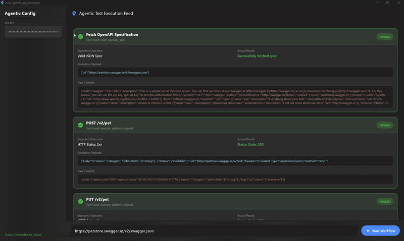
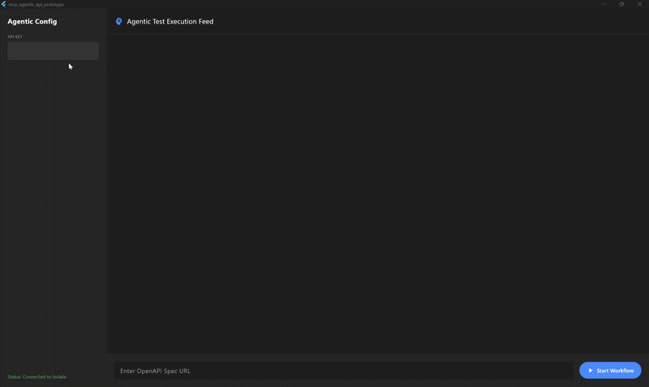

# API Dash Autonomous Testing Agent PoC - GSOC 2026

An experimental prototype that brings **Human-in-the-Loop (HITL) AI-driven API testing** directly into Flutter. This project leverages Google's Gemini Models and the Model Context Protocol (MCP) to autonomously read OpenAPI specifications, dynamically generate chained HTTP requests, and execute them safely under user supervision.

---

## The approach

Traditional API testing requires developers to manually parse Swagger files, copy endpoints, build JSON payloads, and chain requests together (e.g., extracting an ID from a `POST` response to use in a `GET` request).

This prototype flips that paradigm. You provide an **OpenAPI URL** and an **API key**. An autonomous agent (Gemini 2.5 Flash) does the rest:
1. **Reads and comprehends** the complex OpenAPI JSON specification.
2. **Strategizes a multi-step test workflow**, intentionally chaining data between endpoints.
3. **Pauses for Human Consent** before firing any actual HTTP requests, presenting the exact payload to the user in a beautiful, structured UI card.
4. **Executes and Self-Heals.** If a request fails (e.g., a 400 Bad Request), the agent parses the error, fixes the payload, and tries again.
5. **Generates a comprehensive Markdown test report** summarizing the execution lifecycle.

---
## Visual Overview


---
## Architecture

This application employs a modern **Agentic ReAct (Reason + Act)** loop paired with a strict **Isolate-based MCP Backend** for security and performance.

### 1. The Frontend (Flutter UI)
* **ReAct Loop Manager:** Manages the active `ChatSession` with Gemini, parsing text reasoning and intercepting `FunctionCall` requests.
* **HITL Feed:** Renders pending tool calls as interactive UI cards. It pauses the agent's execution loop until the user clicks "Execute Test."
* **Markdown Renderer:** Automatically formats the final agent-generated test reports using `flutter_markdown`.

### 2. The Backend (Dart Isolate via MCP)
* **Model Context Protocol (MCP):** I implemented a native, lightweight version of Anthropic's open-source MCP standard over Dart's `SendPort`/`ReceivePort`.
* **Execution Isolate:** To prevent the UI thread from hanging during heavy HTTP requests or JSON parsing, all tool execution and prompt generation happens in a background Isolate.
* **Tool Handlers:**
    * `read_openapi_spec`: Fetches remote JSON files.
    * `execute_apidash_request`: Constructs HTTP requests from dynamic agent payloads and executes them via the `http` package.

---

## Tools & Approaches Used

* **Framework:** Flutter / Dart
* **AI Engine:** Google Generative AI SDK (`google_generative_ai`)
* **Model:** `gemini-2.5-flash` (Chosen for high-speed function calling and context window capabilities).
* **Architecture Pattern:** Human-in-the-Loop (HITL) Agentic Workflow.
* **Communication Protocol:** JSON-RPC 2.0 (Model Context Protocol).
* **UI/UX:** Custom Material 3 Dark Theme with dynamic status badges (Pending/Passed/Failed) and raw JSON payload viewers.

---

## 🚀 Getting Started

### Prerequisites
* Flutter SDK (Version 3.19+)
* A valid Google Gemini API Key. (Get one at [Google AI Studio](https://aistudio.google.com/))

### Installation
1. **Clone the repository and switch to the HITL prototype branch:**
   ```bash
   git clone https://github.com/AbdelrahmanELBORGY/apidash-agentic-prototype.git
   cd mcp_agentic_api_prototype
   git checkout Full_Workflow_Testing_humanInLoop

2. **Install dependencies:**
   ```bash
   flutter pub get

3. **Run the application:**
   ```bash
   flutter run

---

## 🌐Usage Guide
1. Launch the app (desktop or web is recommended for the best layout).

2. Paste your Gemini API Key into the sidebar.

3. In the bottom input bar, paste a valid OpenAPI / Swagger JSON URL, example: `https://petstore.swagger.io/v2/swagger.json`

3. Click Start Workflow.

4. The agent will begin reasoning. When it decides to make a network request, a card will appear. Review the Expected Outcome and Execution Payload.

5. Click Execute Test to approve the action.

6. Repeat until the agent compiles the final Markdown execution report.

---
## Visual Demo

---

## GSoC 2026 Proposal
This prototype is part of a comprehensive proposal for API Dash.