# APIDash CLI + MCP Server — PoC

> **Note:** This is a standalone Proof-of-Concept for GSoC 2026 Idea #6. The CLI and MCP server are built as independent modules to validate the design. Neither is integrated into the main APIDash codebase yet — that is the proposed next step.

A Dart CLI (`apidash` / `ad`) that lets you run, save, and manage API requests from the terminal. Ships a built-in **MCP server** so AI assistants (Claude, GitHub Copilot, Cursor) can use your saved APIDash data as tools.

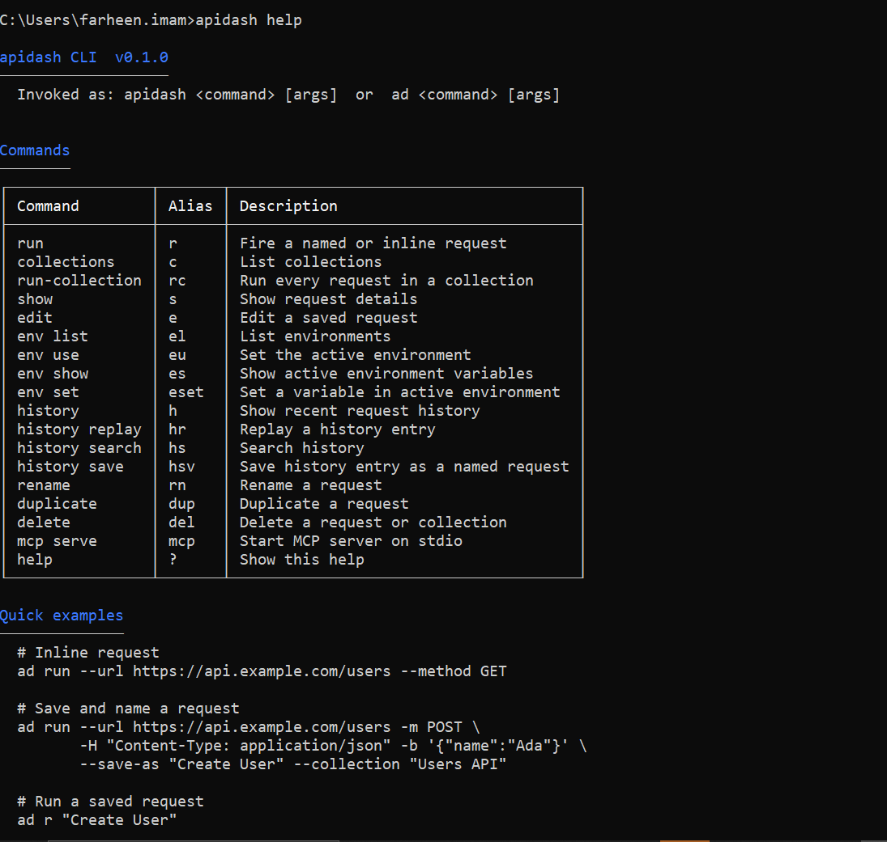
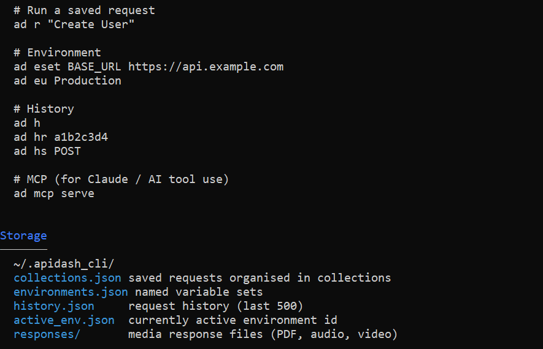

---

## Why CLI over curl?

`curl` fires and forgets. APIDash CLI **remembers**.

| | curl | APIDash CLI |
|---|---|---|
| Fire a request | ✓ | ✓ |
| Save request by name | ✗ | ✓ |
| Organise into collections | ✗ | ✓ |
| Environment variables (`{{token}}`) | ✗ | ✓ |
| History + search + replay | ✗ | ✓ |
| Run a full collection at once | ✗ | ✓ |
| MCP server for AI tool-use | ✗ | ✓ |
| Coloured, formatted output | ✗ | ✓ |

---

## Setup

```bash
# get dependencies
dart pub get

# install globally (registers both `apidash` and `ad` commands)
dart pub global activate --source path .
```

> Make sure `%APPDATA%\Local\Pub\Cache\bin` is in your system PATH.

---

## Quick Demo

```bash
# fire and save
ad run --url https://jsonplaceholder.typicode.com/posts/1 --save-as "Get Post" --collection "Demo"

# run by name
ad r "Get Post"

# collections
ad c
ad rc "Demo"

# environment
ad eset BASE_URL https://jsonplaceholder.typicode.com
ad es

# history
ad h
ad hs GET
ad hr <short-id>
```

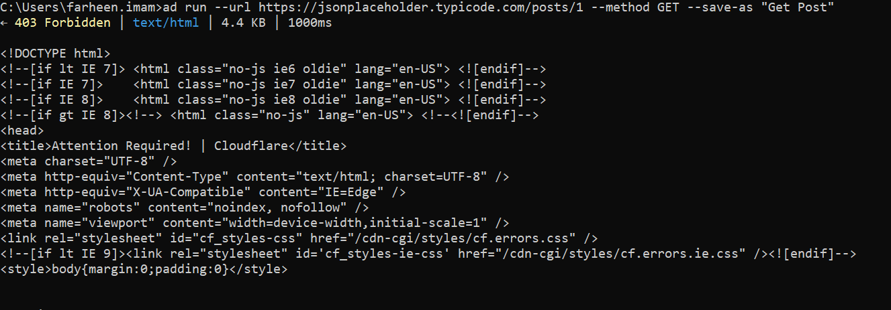
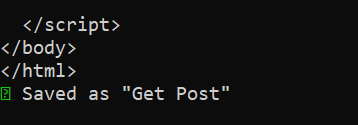
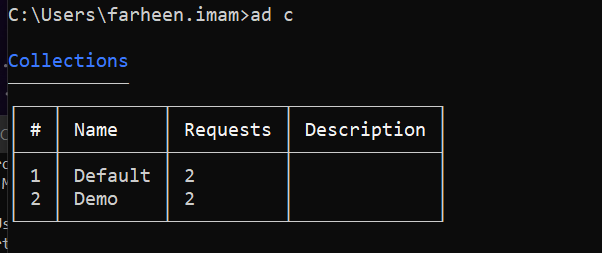
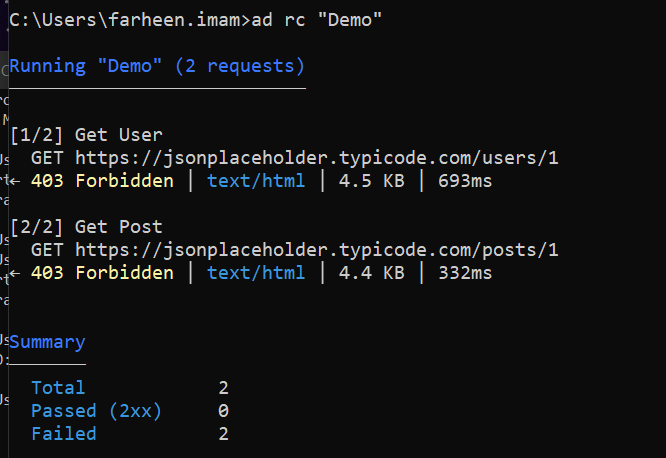
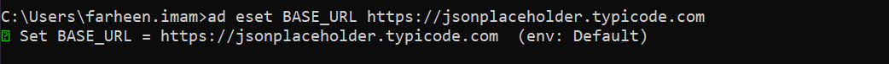
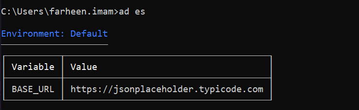
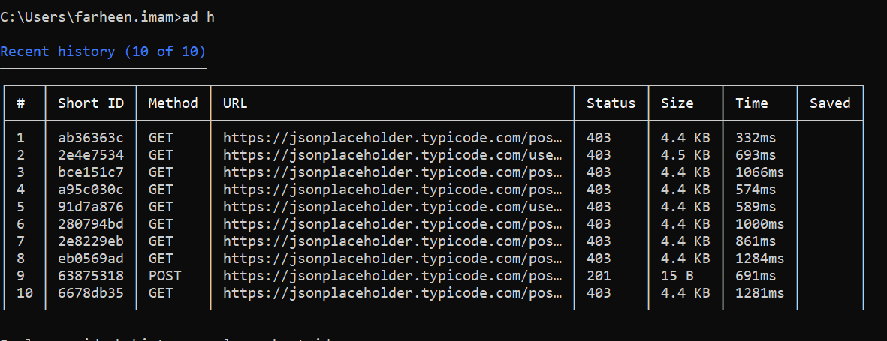

---

## Command Reference

| Command | Alias | What it does |
|---|---|---|
| `run` | `r` | Fire a named or inline request |
| `collections` | `c` | List all collections |
| `run-collection` | `rc` | Run every request in a collection |
| `show` | `s` | Show full request details |
| `edit` | `e` | Edit a saved request |
| `env list` | `el` | List all environments |
| `env use` | `eu` | Set the active environment |
| `env show` | `es` | Show active environment variables |
| `env set` | `eset` | Set a variable in the active environment |
| `history` | `h` | Show recent request history |
| `history replay` | `hr` | Replay a history entry |
| `history search` | `hs` | Search history |
| `history save` | `hsv` | Save a history entry as a named request |
| `rename` | `rn` | Rename a request |
| `duplicate` | `dup` | Duplicate a request |
| `delete` | `del` | Delete a request or collection |
| `mcp serve` | `mcp` | Start MCP server on stdio |
| `help` | `?` | Show help |

---

## MCP Server PoC

> Implemented as a separate module (`lib/mcp/`). In the final integration it will be wired into the APIDash project directly.

Runs over **stdio JSON-RPC 2.0** — the standard transport for VS Code Copilot, Claude Desktop, and Cursor. AI assistants can read and manage your APIDash data as native tools without any copy-pasting.

```bash
ad mcp serve
```

**9 tools implemented:**

| Tool | What it does |
|---|---|
| `list_collections` | List all saved collections |
| `list_requests` | List requests, optionally filtered by collection |
| `run_request` | Fire a saved request, return status + body |
| `run_collection` | Run full collection, return results + summary |
| `get_history` | Fetch last N history entries |
| `get_environment` | Get active environment + variables |
| `set_environment` | Switch the active environment |
| `set_variable` | Set a variable in any environment |
| `edit_request` | Patch method, URL, headers, or body |

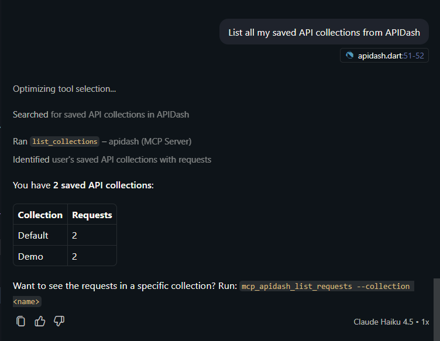
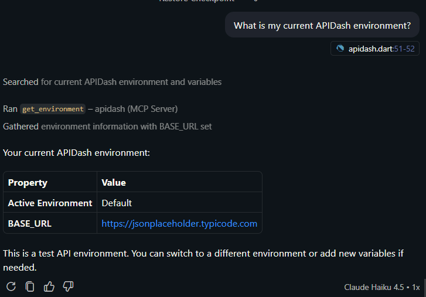
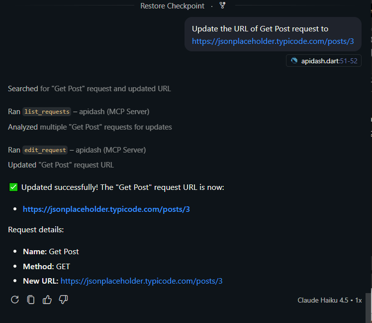
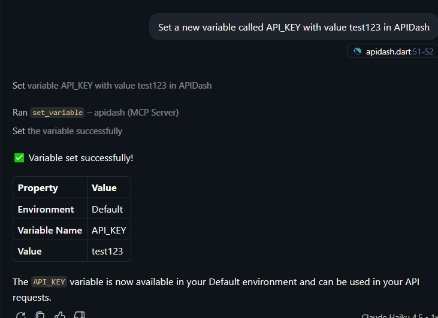

### Connect

**VS Code** — `%APPDATA%\Code\User\mcp.json`:
```json
{
    "servers": {
        "apidash": { "command": "cmd", "args": ["/c", "apidash", "mcp"] }
    }
}
```

**Claude Desktop** — `claude_desktop_config.json`:
```json
{
    "mcpServers": {
        "apidash": { "command": "apidash", "args": ["mcp"] }
    }
}
```

**Test prompts for Copilot Agent mode:**
```
List all my saved API collections from APIDash
Show my last 10 API requests from APIDash history
Run the "Get Post" request using APIDash
What is my current APIDash environment?
Set a variable called API_KEY with value test123 in APIDash
```

When Copilot responds with **"Ran list_collections — apidash (MCP Server)"** the integration is confirmed.

---

## Storage

### PoC — plain JSON

```
~/.apidash_cli/
  collections.json
  environments.json
  history.json
  active_env.json
  responses/          ← media files (PDF, audio, video) auto-saved here
```

### Final integration — Hive CE (same database as APIDash UI)

APIDash stores all data in **Hive CE** (`hive_ce`) across four boxes:

| Box | Contents |
|---|---|
| `apidash-data` | Requests and collections |
| `apidash-environments` | Environments and variables |
| `apidash-history-meta` | History metadata |
| `apidash-history-lazy` | Full request/response bodies |

In the final implementation the CLI and MCP server will replace plain JSON with direct Hive access. APIDash already supports this — `initHiveBoxes()` in `lib/services/hive_services.dart` accepts an `initializeUsingPath` flag that calls `Hive.init(path)` instead of `Hive.initFlutter()`, so the CLI can open the same boxes using pure Dart with no Flutter dependency.

**The result:** requests saved in the UI are immediately available in the terminal, history from the CLI appears in the UI, and the MCP server reads live app data — one database, no sync needed.

---

## Built with

- [`args`](https://pub.dev/packages/args) — command parsing
- [`http`](https://pub.dev/packages/http) — HTTP requests
- [`path`](https://pub.dev/packages/path) — file paths

No Flutter. No Hive. No dependencies on the APIDash repo.
