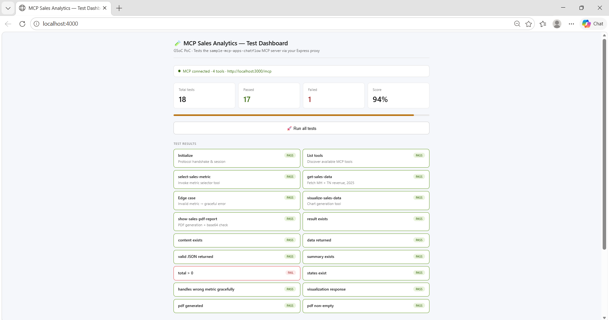

# 🚀 MCP Sales Analytics Server Tester (PoC)

## 📌 Overview

This project is a Proof of Concept (PoC) built for GSoC 2026.

It implements a **CLI-based MCP (Model Context Protocol) testing tool** that connects to a Sales Analytics MCP server, executes its tools, validates responses, and generates a structured test report.

---

## 🎬 Demo

Click the image below to view the POC video:

[](demo/POC.mp4)

---

## 🎯 Objective

To demonstrate:
- MCP server integration
- Automated tool testing
- Assertion-based validation
- Edge case handling

---

## ⚙️ Features

- ✅ Connects to real MCP server (`/mcp`)  
- ✅ JSON-RPC based communication  
- ✅ Tests multiple MCP tools:
  - `initialize`
  - `tools/list`
  - `select-sales-metric`
  - `get-sales-data`
  - `visualize-sales-data`
  - `show-sales-pdf-report`
- ✅ Assertion Engine for validation  
- ✅ Smart data validation (not just structure)  
- ✅ Edge case testing (invalid inputs)  
- ✅ CLI-based execution  
- ✅ PASS / FAIL report with score  

---

## 🧠 How It Works

```text
Tester (CLI)
   ↓
MCP Request (JSON-RPC)
   ↓
MCP Server (Sales Analytics)
   ↓
Response
   ↓
Assertion Engine
   ↓
Test Report (PASS / FAIL)