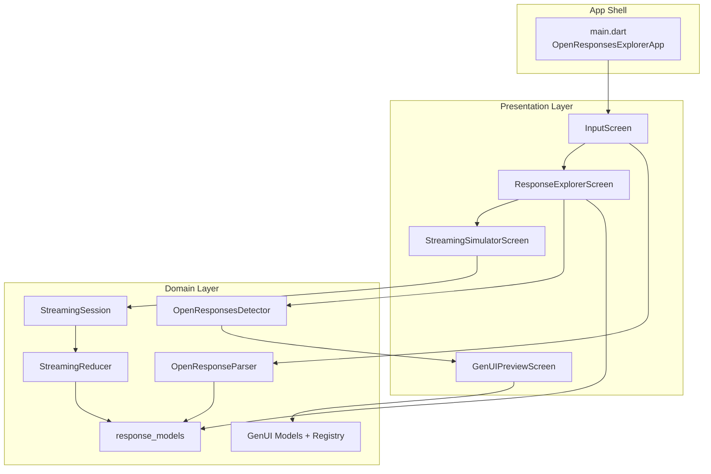

# Open Responses Explorer (GSoC 2026 PoC)

This folder contains the Proof of Concept for exploring and debugging OpenAI Responses payloads with a desktop-focused Flutter interface.

## Project Scope

- Parse Open Responses style JSON payloads into structured models.
- Visualize parsed output in multiple views: Parsed, Calls, Raw, and Diagnostics.
- Replay a response as a streaming session timeline.
- Detect and preview GenUI descriptors when present.
- Support generic JSON inspection when payloads do not fully match Open Responses schema.

## Tech Stack

- Flutter (Material 3)
- Dart SDK 3.11+
- package_info_plus (app metadata shown in About dialog)
- url_launcher (for external links from the app)

## Architecture

The app follows a simple layered structure.

### Architecture Diagram



### 1. Presentation Layer

- `lib/screens/input_screen.dart`
	- Entry screen for paste/sample/streaming/genui modes.
	- Handles theme toggle, parse actions, validation feedback, Enter shortcut submit, and About dialog with app version.
- `lib/screens/response_explorer_screen.dart`
	- Main analysis surface with tabs: Parsed, Calls, Raw, Diagnostics.
	- Includes parsed-tab search, dismissible GenUI banner, and code-like raw JSON view.
- `lib/screens/streaming_simulator_screen.dart`
	- Event feed + live response simulation and playback controls.
	- Uses faster inter-item replay pacing for denser timelines.
- `lib/screens/gen_ui_preview_screen.dart`
	- Visual preview for detected GenUI descriptors.

### 2. Domain Layer

- `lib/domain/response_models.dart`
	- Core domain entities: `ParsedResponse`, `ResponseItem` variants, `CorrelatedCall`.
- `lib/domain/open_response_parser.dart`
	- Converts raw JSON into typed domain models.
	- Correlates function calls with function_call_output items.
	- Provides fallback handling for generic JSON payloads.
- `lib/domain/open_responses_detector.dart`
	- Detects GenUI descriptors inside messages, unknown items, and tool outputs.
- `lib/domain/streaming_reducer.dart`
	- Reducer that applies streaming events to incremental response state.
- `lib/domain/streaming_session.dart`
	- Session wrapper exposing a stream of reducer state updates.
- `lib/domain/gen_ui_*.dart`
	- GenUI descriptor models, registry, and sample descriptors.

### 3. App Shell

- `lib/main.dart`
	- Application bootstrap.
	- Theme management (shared seed/background colors) and route registration.
	- Entry route to `InputScreen`.

### 4. Shared Utilities

- `lib/app_colors.dart`
	- Centralized app color constants used across screens/themes.
- `lib/routing.dart`
	- Reusable slide-up route transition helper.

## Data Flow

### Parse and Explore Flow

1. User pastes JSON or loads a sample in `InputScreen`.
2. Input is normalized and parsed by `OpenResponseParser`.
3. A `ParsedResponse` is created with typed response items.
4. UI navigates to `ResponseExplorerScreen`.
5. Explorer renders views from the same domain object:
	 - Parsed timeline
	 - Correlated tool calls
	 - Pretty printed raw JSON
	 - Diagnostics findings

### Streaming Replay Flow

1. A parsed response is passed into `StreamingSimulatorScreen` as seed state.
2. Simulation events are generated or loaded.
3. `StreamingSession` forwards each event to `StreamingReducer`.
4. Reducer updates session state with the latest `ParsedResponse` snapshot.
5. UI reads synchronized snapshots to keep event timeline and live response panel aligned.

### GenUI Detection Flow

1. Explorer checks parsed items via `OpenResponsesDetector`.
2. If a valid descriptor is found, user can open `GenUIPreviewScreen`.
3. Descriptor is rendered using the GenUI component registry.

## UX and Performance Notes

- Parse actions can be triggered with Enter / Numpad Enter when the active mode has valid input context.
- Parse button is disabled on empty input to reduce accidental no-op actions.
- About dialog shows app version from package metadata.
- Search UI is scoped to the Parsed tab and closes automatically when leaving it.
- Diagnostics summary is precomputed for stable tab rendering.
- GenUI preview banner can be dismissed in Parsed view.
- Placeholder panels are width-constrained for better readability on wide layouts.
- Highlighted timeline text uses memoized spans to reduce unnecessary rebuild work.
- Streaming replay uses shorter inter-item delay (`120ms`) for faster, clearer progression.

## Repository Structure

```
2026/
	README.md
	open_responses_explorer/
		lib/
			main.dart
			app_colors.dart
			routing.dart
			domain/
				gen_ui_component_registry.dart
				gen_ui_models.dart
				gen_ui_samples.dart
				open_response_parser.dart
				open_responses_detector.dart
				response_models.dart
				streaming_reducer.dart
				streaming_session.dart
			screens/
				input_screen.dart
				response_explorer_screen.dart
				streaming_simulator_screen.dart
				gen_ui_preview_screen.dart
			widgets/
				gen_ui/
					gen_ui_component_widgets.dart
		test/
			response_explorer_smoke_test.dart
```

## Local Setup

From `2026/open_responses_explorer`:

1. Install dependencies

	 `flutter pub get`

2. Run the app

	 `flutter run`

3. Run smoke test

	 `flutter test test/response_explorer_smoke_test.dart`

4. Run analyzer and full test suite

	 `flutter analyze`

	 `flutter test`

## References

- GSoC proposal PR: https://github.com/foss42/apidash/pull/1608
- Old test PoC PR: https://github.com/foss42/gsoc-poc/pull/29
- Final PoC PR: https://github.com/foss42/gsoc-poc/pull/51
- Author profile: https://github.com/dhairyajangir

