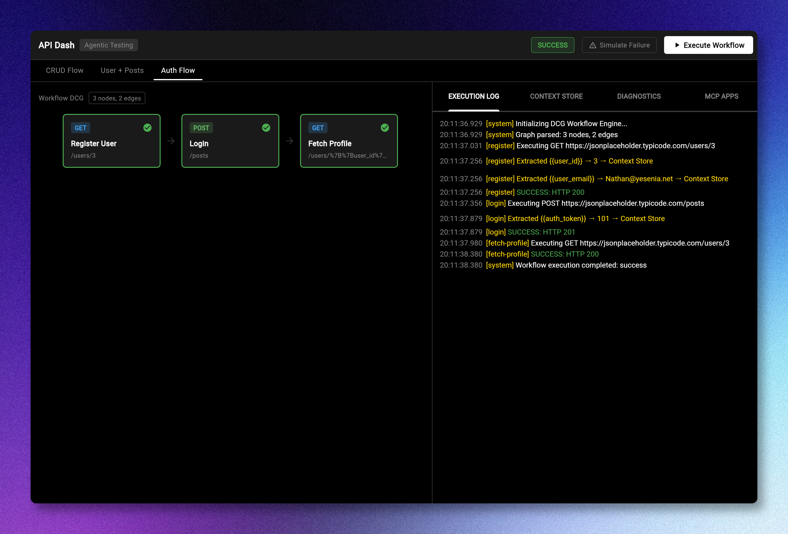
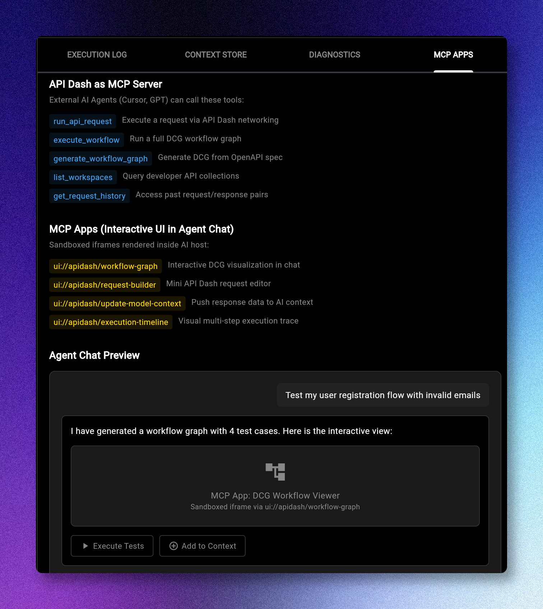
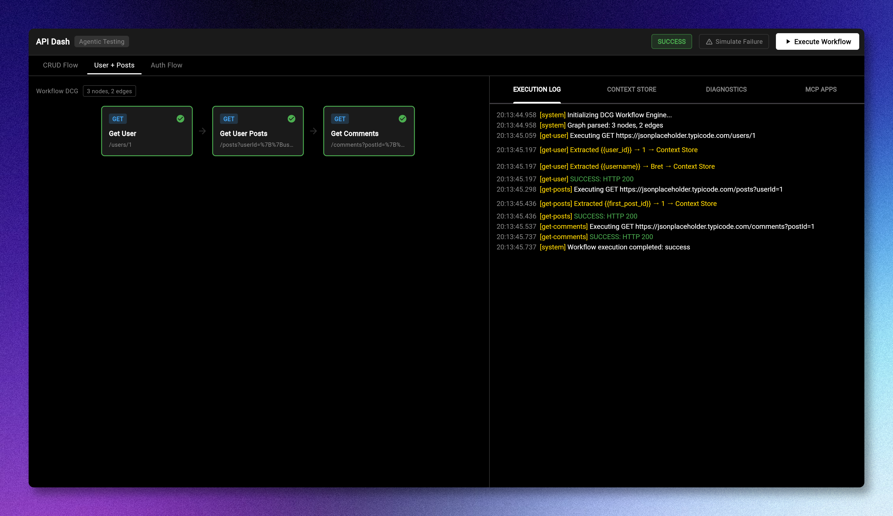
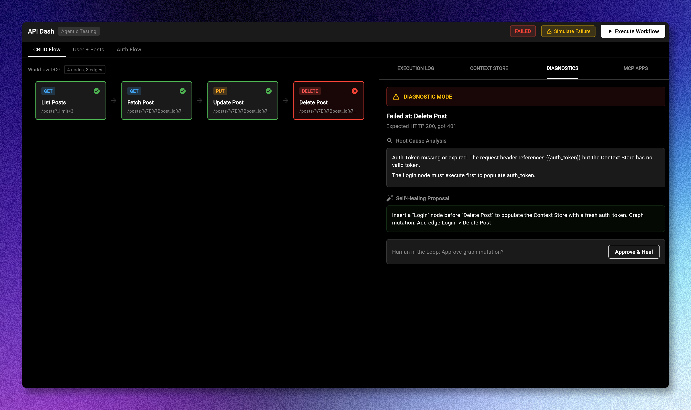

# GSoC 2026 PoC: Agentic API Testing

**Author:** Arun Kumar ([@carbonFibreCode](https://github.com/carbonFibreCode))
**Proposal:** [PR #1424](https://github.com/foss42/apidash/pull/1424)

## Screenshots






## What it does

DCG workflow engine in Dart that chains API requests as a graph. Each node is a request, edges are data dependencies. The engine runs them in topological order, extracting variables from responses and injecting them into the next request via `{{variable}}` syntax.

When something fails, diagnostic mode kicks in with root cause analysis and a self-healing proposal the user can approve.

The MCP Apps tab shows how this would plug into external AI agents as an MCP server.

## Setup

```bash
flutter pub get
flutter run -d chrome
```

## Testing

```bash
flutter test test/core/
```

## Project structure

- `lib/core/models/` — workflow node, edge, execution result, diagnostic report
- `lib/core/engine/` — workflow engine (uses `directed_graph`), context store, state machine, diagnostics
- `lib/core/utils/` — json path extractor, template substitutor
- `lib/core/mcp/` — MCP server tool/resource definitions
- `lib/ui/` — Flutter web UI (theme, screens, widgets)
- `test/core/` — 15 unit tests

## Workflows included

- **CRUD Flow** — List posts, fetch one, update it, delete it. Chains `{{post_id}}` across all 4 requests.
- **User + Posts** — Get user, get their posts, get comments on first post. Multi-level variable extraction.
- **Auth Flow** — Register, login, fetch profile. Toggle "Simulate Failure" to trigger diagnostic mode with RCA and self-healing.

## Links

- [API Dash](https://github.com/foss42/apidash)
- [Proposal PR #1424](https://github.com/foss42/apidash/pull/1424)
- [MCP Apps Reference](https://github.com/ashitaprasad/sample-mcp-apps-chatflow)
