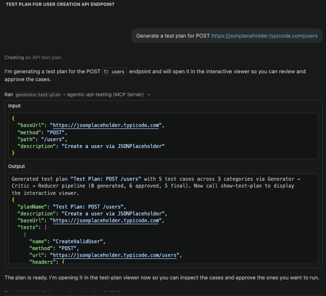
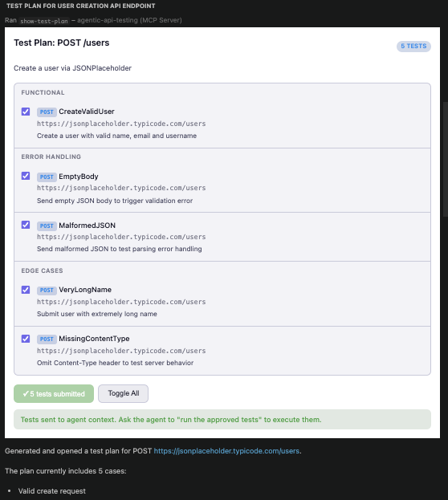
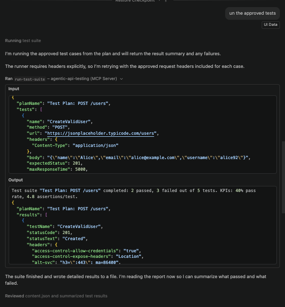
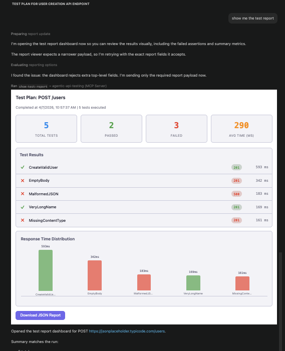
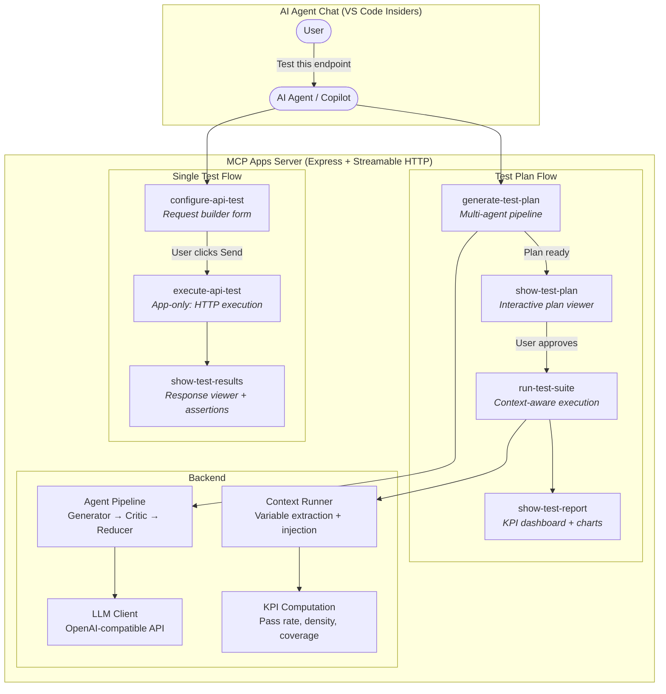
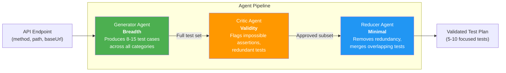
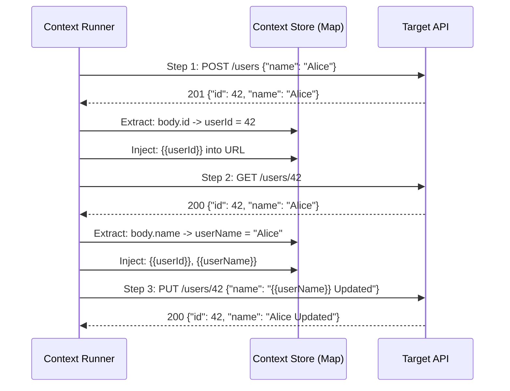
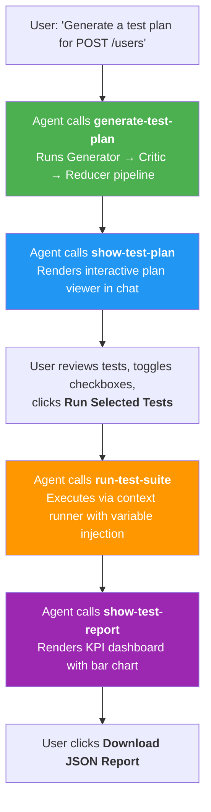

# Agentic API Testing - MCP Apps Server

**GSoC 2026 Proof of Concept** by [Ayazhan Kadessova](https://github.com/ayazhankadessova)

An MCP (Model Context Protocol) Apps server that delivers **agentic API testing** capabilities as interactive UIs inside an AI agent's chat window. Built following the [MCP Apps chatflow pattern](https://github.com/ashitaprasad/sample-mcp-apps-chatflow) as directed by the [project mentor](https://github.com/foss42/apidash/pull/1468#issuecomment-4181156604).

**Proposal PR:** [foss42/apidash#1468](https://github.com/foss42/apidash/pull/1468)

## Demo

| Step 1: Generate Test Plan (Multi-Agent Pipeline) | Step 2: Interactive Test Plan Viewer |
|:---:|:---:|
|  |  |
| Agent runs Generator -> Critic -> Reducer pipeline via Kimi AI. Produces validated, minimal test plan with 5 focused test cases. | Interactive MCP App UI with checkboxes for each test. User reviews, toggles, and approves tests before execution. |

| Step 3: Run Approved Tests | Step 4: Test Report Dashboard |
|:---:|:---:|
|  |  |
| Context runner executes approved tests with variable extraction/injection between steps. Results show pass/fail per test. | KPI dashboard with stats (5 total, 3 passed, 3 failed), response time bar chart, and per-test results list. |

## What This PoC Demonstrates

1. **Multi-Agent Test Generation** -- LLM-powered Generator -> Critic -> Reducer pipeline produces validated, minimal test plans (not just hardcoded templates)
2. **Context-Aware Execution** -- Variable extraction from responses and `{{variable}}` injection into subsequent requests enables multi-step API workflows
3. **KPI Measurement** -- Pass rate, assertion density, endpoint coverage, and response time metrics quantify test quality
4. **MCP Apps Integration** -- Interactive HTML UIs rendered inside the AI agent's chat window via the MCP Apps specification
5. **Graceful Degradation** -- Works without an LLM API key using a deterministic test generator

## Architecture



## Multi-Agent Pipeline

When `LLM_API_KEY` is configured, `generate-test-plan` runs a three-stage LLM pipeline inspired by [Agentize's](https://github.com/Synthesys-Lab/agentize) adversarial review pattern:



Each stage falls back to the previous stage's output on failure. Without an API key, the system uses a deterministic generator.

**Example pipeline output:**
```
[Pipeline] Running Generator agent...     -> 15 tests produced
[Pipeline] Running Critic agent...        -> 15/15 approved (7 flagged)
[Pipeline] Running Reducer agent...       -> 7 final tests
```

## Context-Aware Execution

`run-test-suite` uses a context runner that passes state between test steps -- enabling multi-step API workflows like "create resource -> extract ID -> use ID in next request":



**Features:**
- **Extract**: Pull values from responses using safe dot-path notation (`body.data.id`, `body.items[0].token`, `headers.authorization`)
- **Inject**: Replace `{{varName}}` placeholders in URLs, headers, and request bodies
- **Trace**: Each step records a context store snapshot for debugging
- **Security**: Custom dot-path resolver with no `eval` or JSONPath dependency (avoids CVE-2026-1615)

## KPI Metrics

The test report dashboard includes quality metrics computed from execution results:

| KPI | What It Measures | How It's Computed |
|-----|-----------------|-------------------|
| **Pass Rate** | Overall test success | `passed / total * 100%` |
| **Assertion Density** | Depth of validation per test | `totalAssertions / totalTests` (target: 3+) |
| **Endpoint Coverage** | Breadth of testing | Count of unique URL paths tested |
| **Avg Response Time** | Performance profile | `sum(responseTimes) / count` |

## Chatflow: Step-by-Step



## Tools Summary

| Tool | Visibility | Description |
|------|-----------|-------------|
| `configure-api-test` | model + app | Opens the interactive request builder form UI |
| `execute-api-test` | **app only** | Executes HTTP request server-side (only callable from UI iframe) |
| `show-test-results` | model + app | Displays response viewer with assertions, headers, timing |
| `generate-test-plan` | model | Runs multi-agent pipeline, returns plan data (no UI) |
| `show-test-plan` | model + app | Renders interactive test plan viewer with approval controls |
| `run-test-suite` | model + app | Executes approved tests via context runner, computes KPIs |
| `show-test-report` | model + app | Renders visual dashboard with bar chart and KPI cards |

## How This Maps to the Full GSoC Proposal

| PoC Component | GSoC Proposal Component (Weeks) |
|---|---|
| `generate-test-plan` with Generator -> Critic -> Reducer | Multi-Agent Test Strategy Layer (Week 1-2) |
| Context runner with `{{variable}}` extraction/injection | FSM Execution Engine with Context Store (Week 3-4) |
| `show-test-plan` with approval checkboxes | Human-in-the-Loop Approval Gate via DashBot (Week 5-6) |
| `show-test-report` with KPI cards | KPI Measurement & Reporting (Week 9-10) |
| MCP Apps server with 7 tools | MCP Apps Integration for external agents (Week 9-10) |
| Graceful degradation without API key | Deterministic fallback for CI/demo environments |

## Project Structure

```
agentic-api-testing-poc/
├── .env.example              # LLM configuration template
├── .vscode/mcp.json          # VS Code MCP server config
├── package.json              # Dependencies: MCP SDK, Express, Zod (no LLM SDK)
├── tsconfig.json
└── src/
    ├── index.ts              # Express server + 7 MCP tool registrations
    ├── styles.ts             # Shared CSS + MCP App postMessage bridge
    ├── config/
    │   └── llm.ts            # OpenAI-compatible LLM client (native fetch)
    ├── agents/
    │   └── pipeline.ts       # Generator -> Critic -> Reducer pipeline
    ├── fsm/
    │   └── context-runner.ts # Variable extraction, injection, step trace
    ├── ui/
    │   ├── request-builder.ts  # Interactive request config form
    │   ├── test-results.ts     # Response viewer with assertions
    │   ├── test-plan.ts        # Test plan viewer with approval controls
    │   └── test-report.ts      # KPI dashboard with bar chart
    └── utils/
        ├── http-client.ts      # HTTP execution + assertion engine
        └── test-plan-generator.ts  # Deterministic fallback generator
```

## Setup & Run

### Prerequisites

- Node.js 22+
- VS Code Insiders (for MCP Apps rendering) or any MCP-compatible client

### Install & Start

```bash
cd agentic-api-testing-poc
npm install
cp .env.example .env  # Edit with your LLM API key (optional)
npm run dev
```

The server starts at `http://localhost:8000/mcp`.

### LLM Configuration (Optional)

Set these in `.env` to enable the multi-agent pipeline:

```bash
LLM_API_KEY=your-api-key         # Required for agent pipeline
LLM_BASE_URL=https://api.openai.com/v1  # Any OpenAI-compatible endpoint
LLM_MODEL=gpt-4o-mini            # Default model
```

Tested with: **OpenAI** (gpt-4o-mini), **Kimi AI / Moonshot** (kimi-k2-turbo-preview). Any OpenAI-compatible API works.

Without `LLM_API_KEY`, the system works with a deterministic test generator (zero LLM calls).

### Connect from VS Code Insiders

1. Start the server with `npm run dev`
2. Add to `.vscode/mcp.json`:

```json
{
  "servers": {
    "agentic-api-testing": {
      "type": "http",
      "url": "http://localhost:8000/mcp"
    }
  }
}
```

3. Open Copilot Chat and try: `Generate a test plan for POST https://jsonplaceholder.typicode.com/users`

### Health Check

```bash
curl http://localhost:8000/health
# {"status":"ok","tools":7,"resources":4}
```

## Tech Stack

| Component | Technology |
|-----------|-----------|
| Server | TypeScript, Express 5, Node.js 22 |
| MCP SDK | `@modelcontextprotocol/sdk` ^1.25.2 |
| Transport | Streamable HTTP (`/mcp` endpoint) |
| Validation | Zod 3.x schemas |
| LLM Client | Native `fetch` to OpenAI-compatible endpoint (zero new dependencies) |
| UI Charts | Pure CSS bar chart (no CDN dependencies) |
| HTTP Client | Native `fetch` |

**Zero new runtime dependencies** for the agent pipeline and FSM engine -- uses native `fetch` for both LLM calls and API test execution.

## Key MCP Apps Patterns Used

- **`text/html;profile=mcp-app`** MIME type for rendering interactive HTML UIs in chat
- **`postMessage` JSON-RPC** for iframe <-> host <-> server communication
- **`visibility: ["app"]`** for app-only tools (user controls when requests fire)
- **`structuredContent`** for typed data passing between tools and UIs
- **`ui/update-model-context`** for feeding test results back to the AI agent
- **`ui/download-file`** for JSON report export from sandboxed iframe
- **Separate generation and display tools** for correct UI rendering timing

## References

- [MCP Apps Architecture Blog Post](https://dev.to/aws/how-i-built-mcp-apps-based-sales-analytics-agentic-ui-deployed-it-on-amazon-bedrock-agentcore-4e9i) -- Studied as directed by [mentor comment](https://github.com/foss42/apidash/pull/1468#issuecomment-4181156604)
- [sample-mcp-apps-chatflow](https://github.com/ashitaprasad/sample-mcp-apps-chatflow) -- Reference implementation for MCP Apps server pattern
- [API Dash](https://github.com/foss42/apidash) -- Target project for GSoC integration
- [Agentize](https://github.com/Synthesys-Lab/agentize) -- Open-source AI agent SDK (multi-agent patterns used in this PoC)
- [GSoC Proposal](https://github.com/foss42/apidash/pull/1468) -- Full proposal: Agentic API Testing with Multi-Agent Generation, FSM Execution, and KPI Measurement
