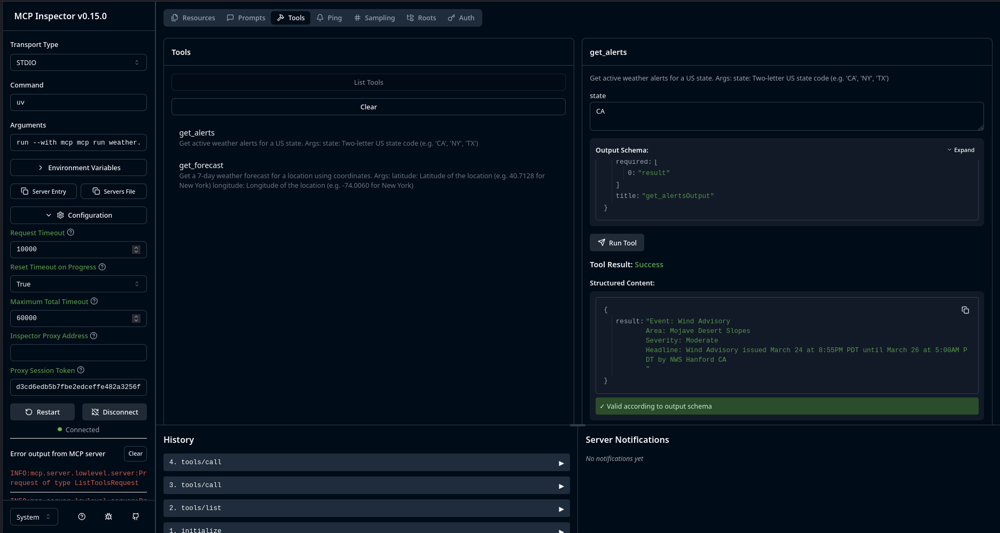

# mcp-weather-poc

A proof-of-concept MCP (Model Context Protocol) server built with **FastMCP**,
created as part of my GSoC proposal for **API Dash — Idea #1: MCP Testing**.

This isn't just a hello-world server — it documents real bugs hit, fixes applied,
and a failed MCP client integration that directly motivates why the API Dash
testing infrastructure needs to be built.

---

## What This Demonstrates

- MCP server built with `FastMCP` (official Python SDK)
- Two tools auto-registered via `@mcp.tool()` decorator
- JSON schema auto-generated from Python type hints + docstrings
- Correct STDIO transport with `stderr`-only logging (no stdout pollution)
- HTTP-level bug found and fixed without using an LLM
- Tested via MCP Inspector v0.15.0 and OpenAI Codex CLI

---

## Tools

| Tool | Description |
|------|-------------|
| `get_alerts` | Fetches active NWS weather alerts for a US state |
| `get_forecast` | Fetches 7-day forecast for a US lat/lon coordinate |

---

## How to Run

**Prerequisites:** Python 3.10+, [uv](https://docs.astral.sh/uv/), Node.js 20+

```bash
git clone https://github.com/Gaurav5189/mcp-weather-poc
cd mcp-weather-poc
uv add "mcp[cli]" httpx
uv run mcp dev weather.py
# Opens MCP Inspector at http://localhost:5173
```

---

## Screenshot



---

## Bugs Hit & Fixed (The Real Learning)

### Bug 1 — `httpx` does not follow redirects by default
The NWS API returns a `301 Moved Permanently` to a rounded coordinate URL
(e.g. `20.593683` → `20.5937`). `httpx` treats this as a terminal error by default,
unlike `requests`. Fix: one parameter — `follow_redirects=True`.

```python
# Before
r = await client.get(url, headers=headers, timeout=10.0)

# After
r = await client.get(url, headers=headers, timeout=10.0, follow_redirects=True)
```

### Bug 2 — Non-US coordinates returned a raw Python traceback
The NWS API is US-only. Passing coordinates outside the covered region caused an unhandled
exception that surfaced directly to the caller — a broken developer experience.
Fixed with an explicit bounding-box check that returns a clean, actionable error message.

```python
longitude_ok = -125.0 <= longitude <= -66.0
if not (24.0 <= latitude <= 50.0 and longitude_ok):
    return (
        f"Error: Coordinates ({latitude}, {longitude}) are outside the contiguous United States (lower 48). "
        "This PoC uses a simple bounding box check; the NWS API is US-covered, but not all US regions "
        "(e.g. Alaska/Hawaii) fall within these bounds. "
        "Try New York (40.7128, -74.0060) or Los Angeles (34.0522, -118.2437)."
    )
```

### Observation — stderr logs appearing as "red errors" in the Inspector
The MCP Inspector labels all stderr output as "Error output" regardless of log level.
The logs were `INFO:` level and entirely correct. This is the **STDIO trap**:
`stdout` is reserved for the JSON-RPC stream. A single `print()` call corrupts
the protocol and crashes the client connection. Always log to `sys.stderr`.

---

## The Codex Experiment — Why API Dash's MCP Tester Is Needed

After verifying the server worked in the Inspector, I tried connecting it to
**OpenAI Codex CLI** as a real-world MCP client test.

After correctly configuring `~/.codex/config.toml`:

```toml
[mcp_servers.weather-poc]
command = "uv"
args = ["run", "--with", "mcp", "mcp", "run", "/path/to/weather.py"]
```

Codex still did not invoke the MCP tool as a first-class function call. Instead,
it read the `weather.py` source code and replicated the NWS API call itself using
`curl` and `node`. The model even acknowledged this:

> *"this chat interface is not exposing the custom MCP tool as a first-class
> callable tool to me, so I fetched it through the local weather MCP project's
> live NWS-backed call from this session."*

**This is the core problem the API Dash MCP Testing feature solves.**

Existing AI CLIs handle MCP tool invocation inconsistently. A developer building
an MCP server today has no reliable, deterministic way to verify their tools are
being called correctly — without burning LLM API credits, without guessing whether
the client silently fell back, and without reading through vague model output to
infer what actually happened.

Every bug in this PoC was caught using the **MCP Inspector's manual JSON payload
tester** — no LLM involved, no ambiguity, direct structured input → structured
output. That is exactly what Phase 3 of the API Dash proposal brings to developers
for their own MCP servers.

---

## GSoC Proposal Architecture

This PoC maps to **Phase 4** of the proposed API Dash MCP Testing feature:

| Phase | What Gets Built |
|-------|----------------|
| **Phase 1** | Node.js protocol adapter using `@modelcontextprotocol/sdk`, spawns MCP server processes via `child_process`, manages JSON-RPC stdio connections |
| **Phase 2** | React dashboard in API Dash for server config, auto-discovers tools via `tools/list` and `resources/list`, renders live tool schemas |
| **Phase 3** | Manual JSON payload testing engine — construct tool calls by hand, capture responses and error stack traces, debug without LLM |
| **Phase 4** | Dummy Python MCP servers (like this one) as automated test targets for API Dash's own CI/CD pipeline |

---

*Stack: Python 3.13 · uv · FastMCP 1.26.0 · httpx · MCP Inspector v0.15.0 · OpenAI Codex CLI · Parrot OS*