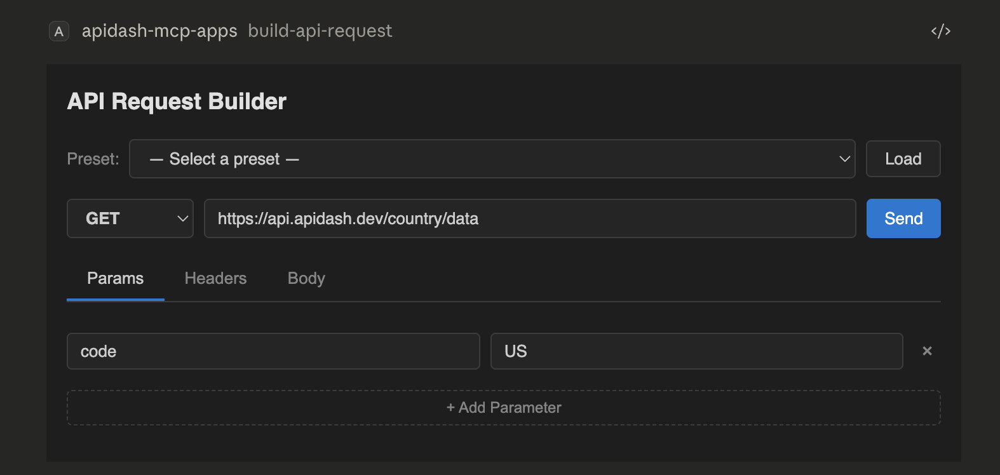
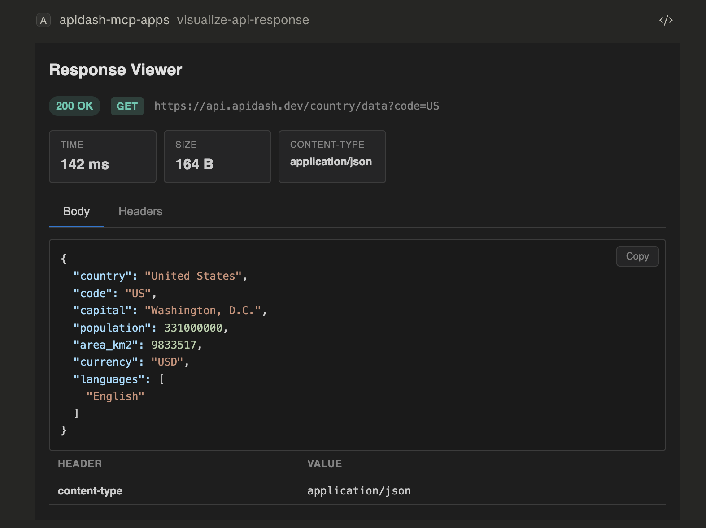
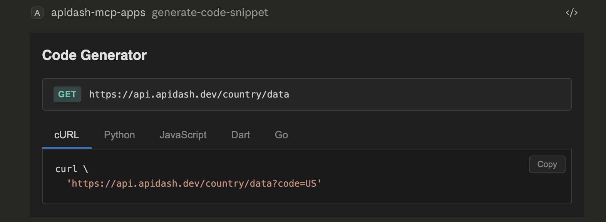
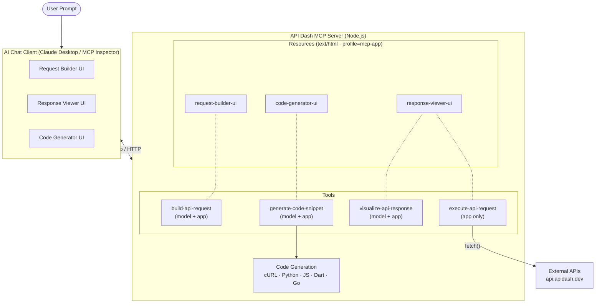

# API Dash MCP Apps Server

> **GSoC 2026 PoC** — CLI & MCP Support for [API Dash](https://github.com/foss42/apidash)

A TypeScript MCP server that exposes API Dash's core features as interactive **MCP Apps** — rich HTML UIs rendered inside AI chat clients like Claude Desktop.

## Demo

MCP Apps rendering inside Claude Desktop:

<table>
  <tr>
    <td align="center"><b>Request Builder</b></td>
    <td align="center"><b>Response Viewer</b></td>
  </tr>
  <tr>
    <td></td>
    <td></td>
  </tr>
  <tr>
    <td align="center" colspan="2"><b>Code Generator</b></td>
  </tr>
  <tr>
    <td align="center" colspan="2"></td>
  </tr>
</table>

## Architecture



## Setup

```bash
npm install
npm run build
```

## Running

**HTTP mode** (for MCP Inspector / testing):
```bash
npm run dev
```

**Stdio mode** (for Claude Desktop) — add to `~/Library/Application Support/Claude/claude_desktop_config.json`:

```json
{
  "mcpServers": {
    "apidash-mcp-apps": {
      "command": "node",
      "args": [
        "/absolute/path/to/2026/luxshan_thavarasa_cli_mcp_support/dist/stdio.js"
      ]
    }
  }
}
```

## Example Prompts

```
Use build-api-request with preset "GET Country Data"
```

```
Use execute-api-request: GET https://api.apidash.dev/country/data with query param code=US
```

```
Use execute-api-request: POST https://api.apidash.dev/case/lower with header Content-Type: application/json and body {"text": "I LOVE Flutter"}
```

```
Use generate-code-snippet for GET https://api.apidash.dev/humanize/social with query params num=8700000, digits=3
```

## File Structure

```
src/
├── server.ts               MCP server setup (resources + tools)
├── index.ts                HTTP transport (Express)
├── stdio.ts                Stdio transport (Claude Desktop)
├── styles.ts               Dark theme CSS + postMessage JSON-RPC bridge
├── ui/
│   ├── request-builder.ts  Request builder form
│   ├── response-viewer.ts  Response visualization
│   └── code-generator.ts   Tabbed code snippet viewer
├── utils/
│   └── codegen.ts          Multi-language code generation (cURL, Python, JS, Dart, Go)
└── data/
    └── sample-requests.ts  Preset requests from API Dash test suite
```

## Connection to GSoC Proposal

This PoC demonstrates the core concept from the CLI & MCP Support proposal:

- **API Dash features as MCP tools** — request building, execution, visualization, codegen
- **Interactive MCP Apps** — rich HTML UIs in sandboxed iframes, not just text
- **Server-side HTTP execution** — avoids CORS, matches how the full Dart MCP server would work
- **Multi-language codegen** — faithful ports of API Dash's Dart codegen templates
- **Dual transport** — stdio for Claude Desktop, HTTP for MCP Inspector

The full GSoC implementation extends this to work with API Dash's Hive database, `apidash_core` models, and `better_networking` HTTP engine via a Dart MCP server.
