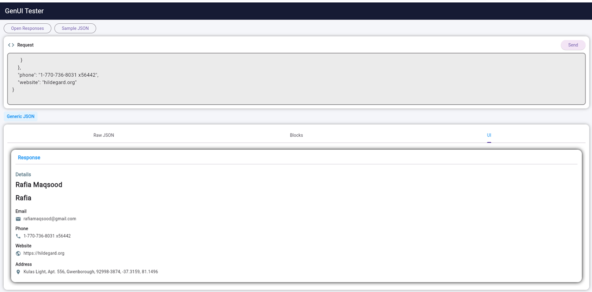

# Generative UI from JSON / Open Responses (Flutter PoC)

A Flutter Proof of Concept (PoC) that converts structured JSON (including OpenAI-style Open Responses) into runtime-generated UI using a modular pipeline architecture.

---

## Project Goal

This PoC demonstrates:

- Converting raw JSON / API responses into UI automatically
- Introducing an intermediate schema (`UIBlock`)
- Rendering UI dynamically without hardcoding screens
- Supporting multiple response formats in a single pipeline
- Bridging LLM outputs → structured UI rendering

---

## Supported Input Formats

### Generic JSON

```json
{
  "name": "Rafia",
  "email": "test@example.com",
  "city": "Lahore"
}
```

### OpenAI-style Open Responses

```json
{
  "output": [
    { "type": "output_text", "text": "Hello" },
    {
      "type": "output_table",
      "columns": ["A", "B"],
      "rows": [[1, 2], [3, 4]]
    }
  ]
}
```

Open Responses format is detected when the JSON contains an `output` array with objects containing a `type` field.

---

## Architecture Overview

```
Input JSON
   ↓
UIPipeline (Detection Layer)
   ↓
Parser Layer
   ├── JsonToUIConverter (Generic JSON)
   └── OpenResponsesParser (Open Responses format)
   ↓
UIBlock (Intermediate Schema)
   ↓
UIGroupBuilder (Grouping Layer)
   ↓
UIRenderer (Flutter UI)
```

---

## Core Concept: UIBlock

The project converts all supported formats into `UIBlock` objects:

- text
- image
- email
- phone
- link
- table
- markdown
- card
- address

---

## Key Features

- Auto-detect Open Responses vs Generic JSON
- Dynamic UI generation
- Markdown rendering (flutter_markdown)
- Table rendering (DataTable)
- Nested card structures
- Safe fallback handling for unknown output types
- Debug tabs: Raw JSON / Blocks / Rendered UI

---

## How to Run

```bash
flutter pub get
flutter run
```

---

## Testing

This PoC includes unit tests for the Open Responses parser:

- output_text parsing
- output_image parsing
- output_table parsing
- output_markdown parsing
- output_card parsing
- nested structures
- invalid input handling

Run tests:

```bash
flutter test
```

---

## Folder Structure

```
lib/
 ├── core/
 │   ├── model/
 │   ├── parser/
 │   ├── pipeline/
 │   └── widgets/
 ├── screens/
 └── services/

test/
```

---

## Screenshots / Demo


[Click here to watch the demo](assets/video/demo.mp4)
---

## Limitations (PoC Scope)

- This PoC supports only a minimal subset of Open Responses output types.
- Streaming responses are not supported yet.
- The intermediate UI schema is intentionally small for MVP validation.

---

## Tech Stack

- Flutter / Dart
- flutter_markdown
- cached_network_image

---

## Purpose

This PoC validates feasibility of converting Open Responses structured outputs into a reusable UI schema that can later be integrated into API Dash response visualization.

---

## Author

Rafia Maqsood (@rafiamaqsood)

