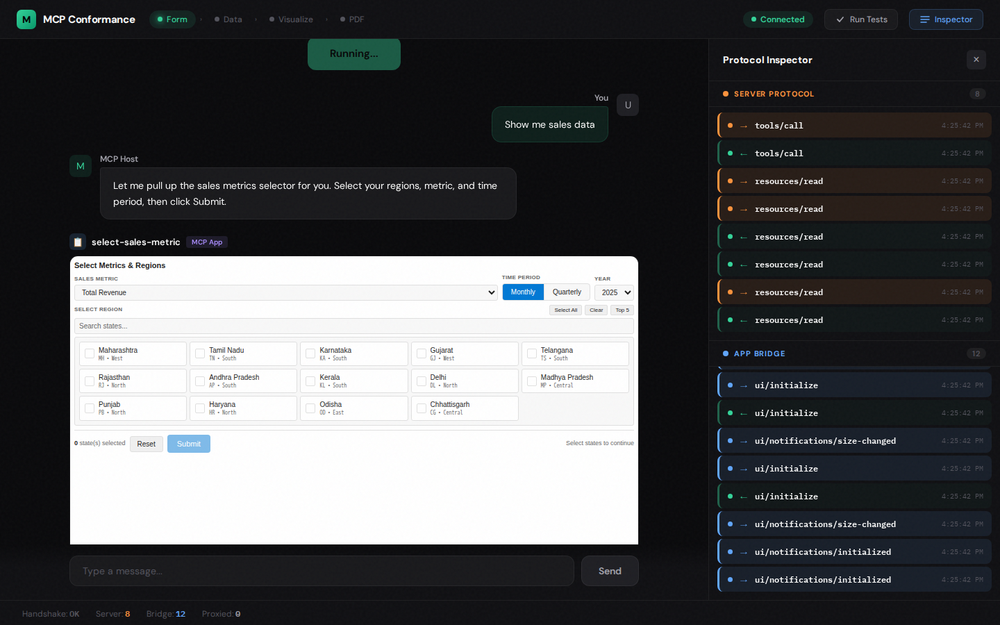

# MCP Conformance Testing Engine

> Protocol-first conformance testing for MCP servers, with full MCP Apps host simulation and interactive viewer.
> **GSoC 2026** — Vinicius Melo ([@vinimlo](https://github.com/vinimlo))
> Proposal: [foss42/apidash#1476](https://github.com/foss42/apidash/pull/1476)

**50 conformance tests.** Validates any MCP server from protocol handshake to rich UI rendering — including a minimal MCP Apps host that runs in a real browser. The only PoC that tests **both sides** of the MCP Apps protocol.

Built on the insight from mentor Ashita Prasad's [Practical Guide to Building MCP Apps](https://dev.to/ashita/a-practical-guide-to-building-mcp-apps-1bfm): _MCP Apps move AI chat from text to rich interactive UI._ This engine verifies that transition actually works.


_Interactive viewer: chat with inline MCP Apps (left), dual protocol inspector showing Server Protocol + App Bridge traffic (right)._

---

## Quick Start

**Prerequisites:** [Docker](https://docs.docker.com/get-docker/) and [Docker Compose](https://docs.docker.com/compose/install/)

### Run all 50 conformance tests

```bash
git clone https://github.com/vinimlo/gsoc-poc.git
cd gsoc-poc/2026/vinicius_mcp_testing
docker compose up tests --build --abort-on-container-exit
```

Expected output:

```
Protocol
  ✓ initialize returns valid result (22ms)
  ✓ server reports protocol version (3ms)
  ✓ server reports name and version (2ms)
  ✓ capabilities is an object (2ms)

Discovery
  ✓ tools/list returns valid array (6ms)

Schema
  ✓ all tools have name and description (0ms)
  ✓ all tools have valid inputSchema (0ms)

Execution
  ✓ tools/call with valid params succeeds (4ms)
  ✓ tools/call with unknown tool returns error (2ms)
  ✓ tool result contains typed content (3ms)
  ✓ tools/call to each discovered tool succeeds (12ms)
  ✓ tool content items have text field (2ms)

Edge Cases
  ✓ unknown method returns error code (2ms)
  ✓ duplicate initialize is idempotent (3ms)
  ✓ concurrent tool calls resolve independently (7ms)
  ✓ tools/call with extra params does not crash (1ms)
  ✓ tools/call with empty arguments object (1ms)
  ✓ JSON-RPC response has correct version field (1ms)
  ✓ error response includes message field (1ms)

MCP Apps
  ✓ get-sales-data returns structuredContent (18ms)
  ✓ structuredContent contains valid report structure (2ms)

MCP Apps: Resources
  ✓ resources/list exposes MCP Apps UI resources (2ms)
  ✓ UI resources use mcp-app MIME type (2ms)
  ✓ UI resources use ui:// URI scheme (1ms)
  ✓ resources/read returns HTML content for UI resources (5ms)
  ✓ UI resources with CSP declare resourceDomains (2ms)

MCP Apps: Metadata
  ✓ tools declare UI resource bindings via _meta (2ms)
  ✓ tools declare visibility levels (2ms)

MCP Apps: Tools
  ✓ visualize-sales-data returns chart structuredContent (3ms)
  ✓ show-sales-pdf-report returns PDF base64 (93ms)

MCP Apps: Workflow
  ✓ tool workflow: select → fetch data pipeline (3ms)
  ✓ full pipeline: select → data → visualize → PDF (54ms)

MCP Apps Host: Rendering
  ✓ sales-form HTML loads without JS errors (1.1s)
  ✓ sales-form renders interactive elements (1.1s)
  ✓ visualization loads Chart.js from CDN (3.3s)
  ✓ visualization renders canvas after data injection (5.1s)
  ✓ PDF viewer loads PDF.js from CDN (4.3s)
  ✓ all UI resources produce non-empty body (4.7s)

MCP Apps Host: Bridge
  ✓ all apps complete ui/initialize handshake (155ms)
  ✓ ui/initialize includes protocolVersion and clientInfo (51ms)
  ✓ host injects hostContext CSS variables (176ms)
  ✓ app sends size-changed notification (2.0s)
  ✓ sales-form calls tools/call via bridge (1.6s)
  ✓ proxied tools/call returns structuredContent from server (37ms)
  ✓ bridge handles ui/update-model-context (36ms)
  ✓ visualization responds to tool-input notification (5.1s)

MCP Apps Host: Text→UI
  ✓ tool produces both text content and structuredContent (6ms)
  ✓ structuredContent renders as charts in visualization UI (6.1s)
  ✓ full pipeline through host: select → data → visualize → PDF (14.4s)
  ✓ visibility enforcement: app-only tools callable only via bridge (58ms)

50 passed (49.2s)
```

### Open the interactive viewer

```bash
docker compose up viewer --build
# Open http://localhost:8080
```

1. Click **"Start Demo"** — the Sales Form MCP App renders inline in chat
2. Select states and metrics in the form, click **Submit**
3. Watch the pipeline cascade: the form fetches data via the bridge, pushes context, and the host automatically triggers Charts and PDF
4. Toggle **Inspector** to see every JSON-RPC message in real time (Server Protocol in orange, App Bridge in blue)
5. Click **Run Tests** to execute all 50 conformance tests from the viewer

### What happens under the hood

```
docker compose up
  ├── mcp-server: Sales Analytics MCP Apps server (cloned from GitHub)
  ├── tests: 50 conformance tests (core + MCP Apps + Playwright host simulation)
  └── viewer: Interactive chat viewer on http://localhost:8080
```

---

## What This Proves

| Tier | Tests | What It Validates |
|------|-------|-------------------|
| **Protocol** | 19 | JSON-RPC 2.0 compliance, transport lifecycle, capability negotiation, edge cases |
| **MCP Apps Metadata** | 13 | structuredContent, `ui://` resources, CSP, `_meta.ui` bindings, visibility levels |
| **MCP Apps Host** | 18 | Real browser rendering (Playwright), iframe bridge handshake, tool proxying, hostContext CSS injection, text→rich UI transition |

**Key architectural insight:** The `PostMessageBridge` powers both the headless Playwright tests AND the interactive viewer. In tests, it's wired via `page.exposeFunction()`. In the viewer, it's wired via HTTP `fetch()`. Same bridge, different transport — proving the architecture is genuinely transport-agnostic.

---

## Architecture

```
                    ┌─────────────────┐
                    │     CLI         │  --suite all|core|mcp-apps|mcp-apps-host
                    │   (cli.ts)      │  --viewer (interactive mode)
                    └────────┬────────┘
                             │
                    ┌────────▼────────┐
                    │   MCPClient     │  JSON-RPC 2.0 — no MCP SDK
                    └────────┬────────┘
                             │
              ┌──────────────┼──────────────┐
              │              │              │
     ┌────────▼──────┐ ┌────▼────────┐ ┌───▼──────────────┐
     │ StdioTransport │ │HttpTransport│ │  HostSimulator   │
     │  child_process  │ │ native fetch│ │  (Playwright)    │
     └───────────────┘ └─────────────┘ │  + PostMessage   │
                                        │    Bridge        │
                                        └──────────────────┘
                                                │
                                        ┌───────▼──────────┐
                                        │  Viewer (Express)│
                                        │  Chat + Inspector│
                                        └──────────────────┘
```

## Files

```
src/
├── transport/
│   ├── stdio.ts              Stdio transport (child_process)
│   └── http.ts               Streamable HTTP transport (native fetch)
├── host/
│   ├── bridge.ts             PostMessageBridge — host-side JSON-RPC handler
│   ├── host-page.ts          Host page template (Playwright + HTTP modes)
│   └── simulator.ts          HostSimulator — Playwright orchestrator
├── viewer/
│   ├── server.ts             Express server — chat engine, bridge, SSE, test runner
│   └── viewer.html           Interactive chat viewer UI
├── client.ts                 MCPClient — JSON-RPC protocol methods
├── assertions.ts             Composable assertion library
├── suite.ts                  19 core conformance tests
├── suite-mcp-apps.ts         13 MCP Apps metadata tests
├── suite-mcp-apps-host.ts    18 MCP Apps host simulation tests
└── cli.ts                    CLI entry point
fixtures/
└── test-server.ts            Minimal MCP server fixture
```

## Design Decisions

- **Zero runtime deps** for the core engine — native `fetch()` and `child_process` only
- **Protocol-direct** — no MCP SDK. Implements JSON-RPC 2.0 from scratch
- **Playwright optional** — 18 host tests use it, 32 core tests don't. Dynamic import with graceful fallback
- **Docker-first** — `docker compose up` runs everything. Zero local installs for reviewers
- **Transport-agnostic bridge** — same `PostMessageBridge` serves Playwright tests and HTTP viewer

## References

- [MCP Specification](https://modelcontextprotocol.io)
- [A Practical Guide to Building MCP Apps](https://dev.to/ashita/a-practical-guide-to-building-mcp-apps-1bfm) — Ashita Prasad
- [Sales Analytics MCP Apps Server](https://github.com/AshitaPrasad/sample-mcp-apps-chatflow) — test target
- [GSoC 2026 Proposal](https://github.com/foss42/apidash/pull/1476)
