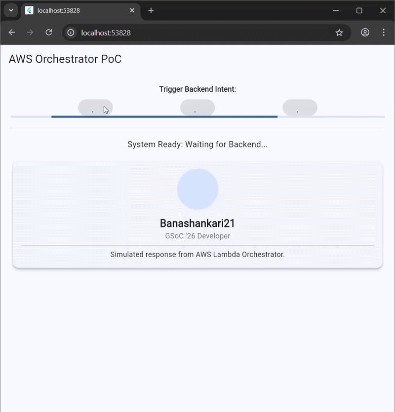

# Generative UI Orchestration PoC

This project is a Proof of Concept (PoC) for **Intelligent API Orchestration**. It demonstrates how a Flutter frontend can dynamically render UI components based on intent-driven data payloads.

## Key Features
* **Orchestration Layer:** Simulates an AWS Lambda backend that processes intents and returns diverse JSON payloads.
* **Dynamic Type Mapping:** A recursive `TypeMapper` that identifies the required UI component (Card, Text, or Error) from raw data.
* **Asynchronous State Management:** Utilizes Flutter Riverpod to handle "thinking" states and loading indicators.
* **Material Motion:** Implements `SharedAxisTransition` for premium morphing between different UI states.

## Technical Architecture
The app simulates the flow between an **MCP (Model Context Protocol)** server and a mobile client, using a simulated network delay to demonstrate production-ready asynchronous handling.